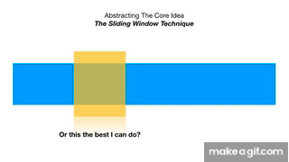

# Topic 3 Sliding Window

The **Sliding Window** technique is a highly efficient approach in programming, particularly useful for solving problems involving arrays or strings. This technique optimizes operations on subsets of data to find results like maximum sum, length, or count of elements. Let's break it down step by step! 🏊‍♂️

---

## 📌 What is Sliding Window?



The **Sliding Window** technique involves maintaining a "window" that moves across a data structure (usually an array or string). This "window" represents a subset of elements, and it can be:

- **Fixed size**: The window size remains constant throughout.
- **Dynamic size**: The window size adjusts based on certain conditions.

### 💡 Key Idea

<br>


Instead of recalculating results for every possible subset, the Sliding Window technique avoids redundant computations by:

1. **Adding** the new element entering the window. ➕
2. **Removing** the old element leaving the window. ➖

This dramatically reduces computation time and improves efficiency. 🚀

---

## 🛠️ How to Apply Sliding Window

<br>


Follow these general steps to apply the Sliding Window technique:

1. **Initialize** a window starting at the beginning of the array or string.
2. Slide the window across the data:
   - Add new elements entering the window.
   - Remove old elements leaving the window.
3. Perform calculations on the current window to update the result.
4. **Return** the final result after processing all possible windows.

---

## 📝 Example 1: Maximum Sum of Subarray of Size `k` 💰

### Problem

Find the maximum sum of any contiguous subarray of size `k` in an array.

### Code

```dart
int maxSumOfSubArray(List<int> arr, int k) {
  int n = arr.length;
  if (n < k) return -1; // Not enough elements

  int maxSum = 0, currentSum = 0;

  // Create the first window
  for (int i = 0; i < k; i++) {
    currentSum += arr[i];
  }
  maxSum = currentSum;

  // Slide the window
  for (int i = k; i < n; i++) {
    currentSum += arr[i] - arr[i - k]; // Add new element, remove old element
    maxSum = max(maxSum, currentSum); // Update max sum
  }

  return maxSum;
}

void main() {
  List<int> arr = [2, 3, 5, 2, 9, 7, 1];
  int k = 3;
  print(maxSumOfSubArray(arr, k)); // Output: 18
}
```

### Explanation 📝

1. Input: `arr = [2, 3, 5, 2, 9, 7, 1]`, `k = 3`
2. Sliding Window Steps:
   - `[2, 3, 5]` → sum = 10
   - `[3, 5, 2]` → sum = 10
   - `[5, 2, 9]` → sum = 16
   - `[2, 9, 7]` → **sum = 18** ✅
   - `[9, 7, 1]` → sum = 17
3. Maximum sum: `18`

---

## 📝 Example 2: Longest Substring Without Repeating Characters 🔑

### Problem

Find the length of the longest substring without repeating characters in a string.

### Code

```dart
int lengthOfLongestSubstring(String s) {
  int maxLength = 0;
  int start = 0;
  Map<String, int> seen = {};

  for (int end = 0; end < s.length; end++) {
    String currentChar = s[end];

    if (seen.containsKey(currentChar)) {
      start = max(start, seen[currentChar]! + 1); // Update start if char repeats
    }

    seen[currentChar] = end; // Update the last seen position
    maxLength = max(maxLength, end - start + 1); // Update max length
  }

  return maxLength;
}

void main() {
  String s = "abcabcbb";
  print(lengthOfLongestSubstring(s)); // Output: 3
}
```

### Explanation 📝

1. Input: `s = "abcabcbb"`
2. Sliding Window Steps:
   - Start: `a` → Length = 1
   - Extend: `ab` → Length = 2
   - Extend: `abc` → Length = **3** ✅
   - Repeat: Move start to skip the first `a`.
   - Final: The longest substring is `abc`, length = `3`.

---

## 🔥 Applications of Sliding Window

1. **Maximum/Minimum Sum Subarray** 💵
2. **Longest Substring Problems** 🔤
3. **Counting Subarrays/Substrings** 🧮
4. Optimizing algorithms for **time and space complexity** ⚡

---

## 🚀 Why Use Sliding Window?

- **Efficiency**: Reduces time complexity from \(O(n^2)\) to \(O(n)\) in many problems.
- **Intuitive**: Mirrors how we naturally approach subsets visually.
- **Widely Applicable**: Used in dynamic programming, searching, and optimization problems.

---

## 🏁 Conclusion

The **Sliding Window** technique is an essential tool for solving many array and string problems. Mastering it can make complex problems much simpler and your solutions more efficient. Keep sliding and coding! 🎯

Happy Coding !!!
